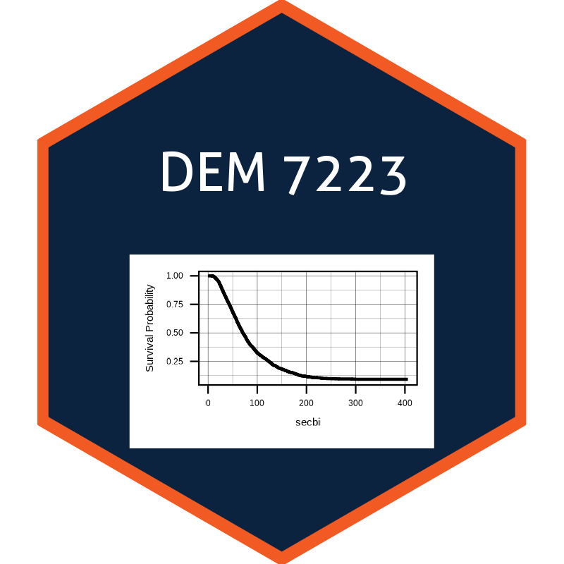

# Demography 7233
## Event History Analysis

### Fall 2022

Thursday 6-8:30  
Instructor: Dr. Corey S. Sparks  
Office hours:  Monday afternoons, preferably by appointment  
corey.sparks@utsa.edu  

## Course Description:
The analysis of duration or event history data are ubiquitous in the social and behavioral sciences, and especially so in demography. Whenever events occur over time the life table and hazards analysis framework is required. This course will introduce students to methods of event history or hazards analysis as used in the field of demography. Topic to be covered include: nonparametric survival analysis, parametric hazards regression models, the Cox proportional hazard model, discrete time hazard models and hierarchical frailty models. The primary format of this course is lecture based with a strong computing component.
  

### Computer skills:
We will be using R. R is the language in which most research statisticians work and current methodological developments are being made, it is also free and can be used on any operating system. 

Please update your R version (4.2.1) to the latest release and update all your packages.

We will use R through Rstudio (https://www.rstudio.com/products/rstudio/download/) and we will use Rpubs for turning in all assignments.

### RTools
You should also install the version 4.0 install of Rtools if you are a windows user.
https://cran.r-project.org/bin/windows/Rtools/
For those of you interested in R, I have published all of the examples from this class, and my other classes to my Rpubs site: http://rpubs.com/corey_sparks, so you can follow along with that stuff if you choose.

I will also post data and other resources to my Github repository https://github.com/coreysparks/DEM7093 

## R packages for the class
Copy and paste the following command in Rstudio to install the packages we will use in this class:

source("https://raw.githubusercontent.com/coreysparks/DEM7223/master/code/install_first_7223.R")

In Rstudio. Please have these programs downloaded and installed prior to class.

## Course texts:
| **Title** | **Author** | **ISBN**| **Status** |
| --- | --- | --- | --- |
| Introducing Survival and Event History Analysis | Mills (M) | 9781848601024 | Required |
|Applied longitudinal data analysis | Singer & Willett (S&W) | 97801195152968  | Required |
| --- | --- | --- |

# Course Calendar
| **Week** | **Date** | **Topic** | **Suggested Reading - Letters refer to numbering of textbooks** |
| --- | --- | --- | --- |
| 1 | 8/25 | Intro to course, Structure and preparation of event history data, Review of life table functions, Single and multiple decrement processes | M 1.1--1.3, M 3, S&W 9 |
| 2 | 9/1 | Quantities and relationships in survival analysis | M 1.4, S&W 10 |
| 3 | 9/8 | Nonparametric estimation of survival curves and hazard rates | M 4|
| 4 | 9/15 | Parametric models | M 6|
| 5 | 9/22 | Parametric models | M 6 |
| 6 | 9/29 | Cox MOdel  | M 5, S&W 14 |
| 7 | 10/6 | extended Cox model | M 7, S&W 14 |
| 8 | 10/13 | Discrete time models | M 8, SW 11-12  |
| 9 | 10/20 |Discrete time models | M 8, SW 11-12 |
| 10 | 10/27 | Frailty models | M 8 |
| 11 | 11/3 | Discrete time frailty models | M 8 |
| 12 | 11/10 |Multi state models  | M ch 10 |
| 13 | 11/17 | **Draft papers due** |  |
| 14 | 11/24 | No class Thanksgiving | |
| 15 | 12/1 | Multi state models  | M ch 10  |
| 16 | 12/9 | **PhD students paper due** |  |
