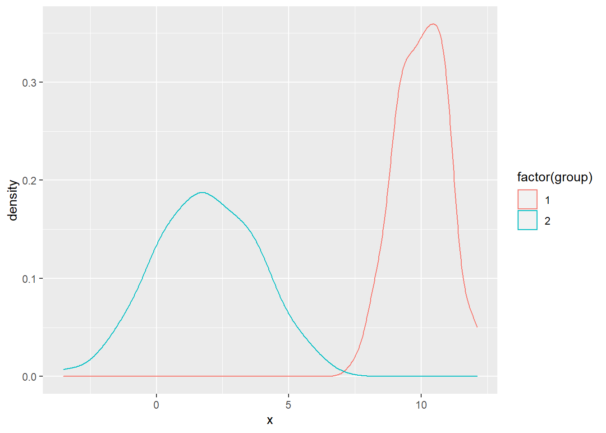
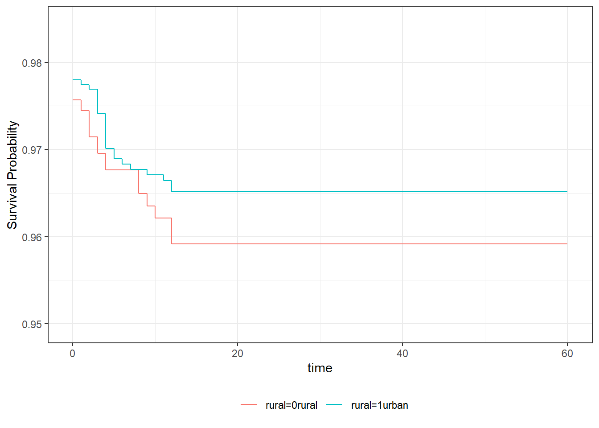
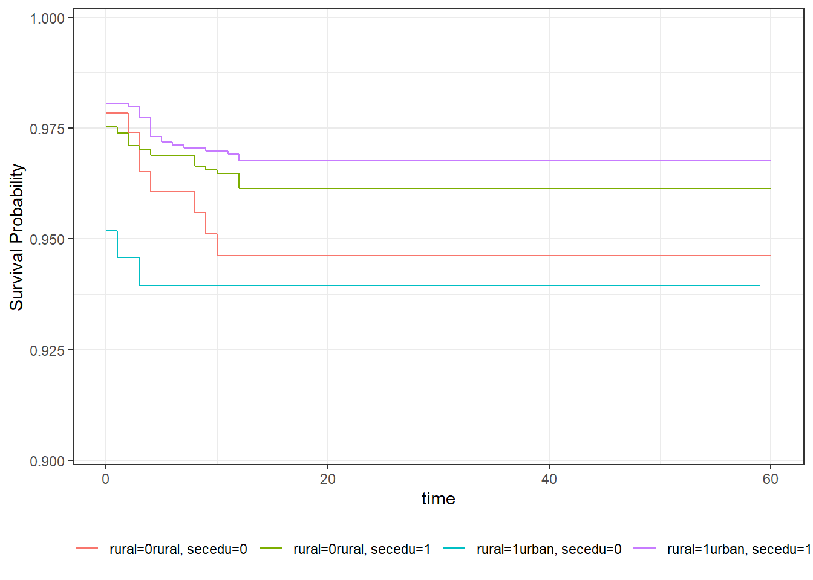

This example will illustrate how to test for differences between survival functions estimated by the Kaplan-Meier product limit estimator. The tests all follow the methods described by Harrington and Fleming (1982) [Link](http://biomet.oxfordjournals.org/content/69/3/553.short). 

The first example will use as its outcome variable, the event of a child dying before age 1. The data for this example come from the model.data [Demographic and Health Survey for 2012](http://dhsprogram.com/data/dataset/model.dat_Standard-DHS_2012.cfm?flag=0) children's recode file. This file contains information for all births in the last 5 years prior to the survey.

The second example, we will examine how to calculate the survival function for a longitudinally collected data set. Here I use data from the [ECLS-K ](http://nces.ed.gov/ecls/kinderdatainformation.asp). Specifically, we will examine the transition into poverty between kindergarten and fifth grade. 


```r
#load libraries
library(haven)
library(survival)
library(car)
```

```
## Loading required package: carData
```

```r
library(muhaz)
model.dat<-read_dta("https://github.com/coreysparks/data/blob/master/ZZKR62FL.DTA?raw=true")
model.dat<-zap_labels(model.dat)
```


## Event - Infant Mortality
In the DHS, they record if a child is dead or alive and the age at death if the child is dead. This can be understood using a series of variables about each child. 

If the child is alive at the time of interview, then the variable B5==1, and the age at death is censored. 

If the age at death is censored, then the age at the date of interview (censored age at death) is the date of the interview - date of birth (in months). 

If the child is dead at the time of interview,then the variable B5!=1, then the age at death in months is the variable B7. Here we code this:


```r
model.dat$death.age<-ifelse(model.dat$b5==1,
                          ((((model.dat$v008))+1900)-(((model.dat$b3))+1900)) 
                          ,model.dat$b7)

#censoring indicator for death by age 1, in months (12 months)
model.dat$d.event<-ifelse(is.na(model.dat$b7)==T|model.dat$b7>12,0,1)
model.dat$d.eventfac<-factor(model.dat$d.event); levels(model.dat$d.eventfac)<-c("Alive at 1", "Dead by 1")
table(model.dat$d.eventfac)
```

```
## 
## Alive at 1  Dead by 1 
##       5434        534
```

### Compairing Two Groups
We will now test for differences in survival by characteristics of the household. First we will examine whether the survival chances are the same for children in relatively high ses (in material terms) households, compared to those in relatively low-ses households.

This is the equvalent of doing a t-test, or Mann-Whitney U test for differences between two groups. 


```r
library(survminer)
```

```
## Loading required package: ggplot2
```

```
## Loading required package: ggpubr
```

```r
model.dat$highses<-Recode(model.dat$v190, recodes ="1:3 = 0; 4:5=1; else=NA")
fit1<-survfit(Surv(death.age, d.event)~highses, data=model.dat)
fit1
```

```
## Call: survfit(formula = Surv(death.age, d.event) ~ highses, data = model.dat)
## 
##              n events median 0.95LCL 0.95UCL
## highses=0 4179    362     NA      NA      NA
## highses=1 1789    172     NA      NA      NA
```

```r
ggsurvplot(fit1, xlim=c(0,12), conf.int=T, title="Survival Function for Infant Mortality - Low vs. High SES Households", ylim=c(.8, 1))
```

<!-- -->

```r
summary(fit1)
```

```
## Call: survfit(formula = Surv(death.age, d.event) ~ highses, data = model.dat)
## 
##                 highses=0 
##  time n.risk n.event survival std.err lower 95% CI upper 95% CI
##     0   4179     134    0.968 0.00273        0.963        0.973
##     1   3992      18    0.964 0.00290        0.958        0.969
##     2   3914      28    0.957 0.00316        0.951        0.963
##     3   3808      24    0.951 0.00337        0.944        0.957
##     4   3709      10    0.948 0.00346        0.941        0.955
##     5   3625      15    0.944 0.00359        0.937        0.951
##     6   3520      20    0.939 0.00376        0.931        0.946
##     7   3414      14    0.935 0.00389        0.927        0.943
##     8   3325      21    0.929 0.00407        0.921        0.937
##     9   3238      17    0.924 0.00422        0.916        0.932
##    10   3159       3    0.923 0.00424        0.915        0.932
##    11   3090      10    0.920 0.00433        0.912        0.929
##    12   3015      48    0.906 0.00475        0.896        0.915
## 
##                 highses=1 
##  time n.risk n.event survival std.err lower 95% CI upper 95% CI
##     0   1789      75    0.958 0.00474        0.949        0.967
##     1   1698       8    0.954 0.00498        0.944        0.963
##     2   1659       9    0.948 0.00524        0.938        0.959
##     3   1615      14    0.940 0.00564        0.929        0.951
##     4   1573      15    0.931 0.00604        0.919        0.943
##     5   1536       7    0.927 0.00622        0.915        0.939
##     6   1501       6    0.923 0.00638        0.911        0.936
##     7   1466       4    0.921 0.00648        0.908        0.934
##     8   1430       5    0.918 0.00662        0.905        0.931
##     9   1383       6    0.914 0.00679        0.900        0.927
##    10   1348       2    0.912 0.00684        0.899        0.926
##    11   1315       3    0.910 0.00693        0.897        0.924
##    12   1288      18    0.897 0.00746        0.883        0.912
```

Gives us the basic survival plot. 

Next we will use `survtest()` to test for differences between the two or more groups. The `survdiff()` function performs the log-rank test to compare the survival patterns of two or more groups.


```r
#two group compairison
survdiff(Surv(death.age, d.event)~highses, data=model.dat)
```

```
## Call:
## survdiff(formula = Surv(death.age, d.event) ~ highses, data = model.dat)
## 
##              N Observed Expected (O-E)^2/E (O-E)^2/V
## highses=0 4179      362      374     0.401      1.37
## highses=1 1789      172      160     0.940      1.37
## 
##  Chisq= 1.4  on 1 degrees of freedom, p= 0.2
```

In this case, we see no difference in survival status based on household SES. 

How about rural vs urban residence?


```r
library(dplyr)
```

```
## 
## Attaching package: 'dplyr'
```

```
## The following object is masked from 'package:car':
## 
##     recode
```

```
## The following objects are masked from 'package:stats':
## 
##     filter, lag
```

```
## The following objects are masked from 'package:base':
## 
##     intersect, setdiff, setequal, union
```

```r
library(car)
model.dat<-model.dat%>%
  mutate(rural = car::Recode(v025, recodes ="2 = '0rural'; 1='1urban'; else=NA", as.factor = T))


fit2<-survfit(Surv(death.age, d.event)~rural, data=model.dat, conf.type = "log")
fit2
```

```
## Call: survfit(formula = Surv(death.age, d.event) ~ rural, data = model.dat, 
##     conf.type = "log")
## 
##                 n events median 0.95LCL 0.95UCL
## rural=0rural 4138    346     NA      NA      NA
## rural=1urban 1830    188     NA      NA      NA
```

```r
summary(fit2)
```

```
## Call: survfit(formula = Surv(death.age, d.event) ~ rural, data = model.dat, 
##     conf.type = "log")
## 
##                 rural=0rural 
##  time n.risk n.event survival std.err lower 95% CI upper 95% CI
##     0   4138     130    0.969 0.00271        0.963        0.974
##     1   3959      15    0.965 0.00286        0.959        0.971
##     2   3879      29    0.958 0.00314        0.952        0.964
##     3   3775      24    0.952 0.00336        0.945        0.958
##     4   3682      15    0.948 0.00349        0.941        0.955
##     5   3590      13    0.944 0.00360        0.937        0.951
##     6   3491      17    0.940 0.00375        0.932        0.947
##     7   3382      13    0.936 0.00387        0.929        0.944
##     8   3299      19    0.931 0.00404        0.923        0.939
##     9   3208      17    0.926 0.00419        0.918        0.934
##    10   3126       3    0.925 0.00422        0.917        0.933
##    11   3060       9    0.922 0.00430        0.914        0.931
##    12   2990      42    0.909 0.00469        0.900        0.918
## 
##                 rural=1urban 
##  time n.risk n.event survival std.err lower 95% CI upper 95% CI
##     0   1830      79    0.957 0.00475        0.948        0.966
##     1   1731      11    0.951 0.00506        0.941        0.961
##     2   1694       8    0.946 0.00528        0.936        0.957
##     3   1648      14    0.938 0.00566        0.927        0.949
##     4   1600      10    0.932 0.00592        0.921        0.944
##     5   1571       9    0.927 0.00615        0.915        0.939
##     6   1530       9    0.922 0.00637        0.909        0.934
##     7   1498       5    0.918 0.00650        0.906        0.931
##     8   1456       7    0.914 0.00668        0.901        0.927
##     9   1413       6    0.910 0.00683        0.897        0.924
##    10   1381       2    0.909 0.00689        0.895        0.922
##    11   1345       4    0.906 0.00700        0.893        0.920
##    12   1313      24    0.890 0.00764        0.875        0.905
```

```r
ggsurvplot(fit2, xlim=c(0,12), ylim=c(.8, 1), conf.int=T, title="Survival Function for Infant mortality - Rural vs Urban Residence")
```

<!-- -->


# Two- sample test


```r
survdiff(Surv(death.age, d.event)~rural, data=model.dat)
```

```
## Call:
## survdiff(formula = Surv(death.age, d.event) ~ rural, data = model.dat)
## 
##                 N Observed Expected (O-E)^2/E (O-E)^2/V
## rural=0rural 4138      346      371      1.67      5.55
## rural=1urban 1830      188      163      3.79      5.55
## 
##  Chisq= 5.6  on 1 degrees of freedom, p= 0.02
```

```r
prop.table(table(model.dat$d.event, model.dat$rural), margin = 2)
```

```
##    
##         0rural     1urban
##   0 0.91638473 0.89726776
##   1 0.08361527 0.10273224
```

```r
chisq.test(table(model.dat$d.event, model.dat$rural))
```

```
## 
## 	Pearson's Chi-squared test with Yates' continuity correction
## 
## data:  table(model.dat$d.event, model.dat$rural)
## X-squared = 5.4595, df = 1, p-value = 0.01946
```
Which shows a statistically significant difference in survival between rural and urban children, with rural children showing lower survivorship at all ages. 


We can also compare the 95% survival point for rural and urban residents

```r
quantile(fit2, probs=.05)
```

```
## $quantile
##              5
## rural=0rural 4
## rural=1urban 2
## 
## $lower
##              5
## rural=0rural 3
## rural=1urban 0
## 
## $upper
##              5
## rural=0rural 6
## rural=1urban 3
```


We can also calculate the hazard function for each group using the `kphaz.fit` function in the `muhaz` library.


```r
haz2<-kphaz.fit(model.dat$death.age, model.dat$d.event, model.dat$rural)
haz2
```

```
## $time
##  [1]  0.5  1.5  2.5  3.5  4.5  5.5  6.5  7.5  8.5  9.5 10.5 11.5  0.5  1.5  2.5
## [16]  3.5  4.5  5.5  6.5  7.5  8.5  9.5 10.5 11.5
## 
## $haz
##  [1] 0.0038314014 0.0075716497 0.0064378810 0.0041197145 0.0036742403
##  [6] 0.0049398949 0.0038930677 0.0058337248 0.0053636408 0.0009670736
## [11] 0.0029830591 0.0143373352 0.0064084477 0.0047764602 0.0086460188
## [16] 0.0063018400 0.0058154299 0.0059338979 0.0033648177 0.0048901211
## [21] 0.0042929999 0.0014588521 0.0030184080 0.0185979202
## 
## $var
##  [1] 9.786715e-07 1.976995e-06 1.727037e-06 1.131544e-06 1.038557e-06
##  [6] 1.435586e-06 1.165912e-06 1.791334e-06 1.692389e-06 3.117631e-07
## [11] 9.887982e-07 4.894885e-06 3.733606e-06 2.852025e-06 5.339922e-06
## [16] 3.971474e-06 3.757836e-06 3.912526e-06 2.264454e-06 3.416455e-06
## [21] 3.071735e-06 1.064171e-06 2.277779e-06 1.441308e-05
## 
## $strata
##  [1] 1 1 1 1 1 1 1 1 1 1 1 1 2 2 2 2 2 2 2 2 2 2 2 2
```

```r
plot(y=haz2$haz[1:12], x=haz2$time[1:12], col=1, lty=1, type="s")
lines(y=haz2$haz[13:24], x=haz2$time[13:24], col=2, lty=1, type="s")
```

<!-- -->

 This may be suggestive that children in urban areas may live in poorer environmental conditions.

### k- sample test
Next we illustrate a k-sample test. This would be the equivalent of the ANOVA if we were doing ordinary linear models. 

In this example, I use the `v024` variable, which corresponds to the region of residence in this data. Effectively we are testing for differences in risk of infant mortality by region.


```r
table(model.dat$v024, model.dat$d.eventfac)
```

```
##    
##     Alive at 1 Dead by 1
##   1       2229       181
##   2       1435       141
##   3        631        94
##   4       1139       118
```

```r
fit3<-survfit(Surv(death.age, d.event)~v024, data=model.dat)
fit3
```

```
## Call: survfit(formula = Surv(death.age, d.event) ~ v024, data = model.dat)
## 
##           n events median 0.95LCL 0.95UCL
## v024=1 2410    181     NA      NA      NA
## v024=2 1576    141     NA      NA      NA
## v024=3  725     94     NA      NA      NA
## v024=4 1257    118     NA      NA      NA
```

```r
#summary(fit3)
#quantile(fit3, probs=.05)

ggsurvplot(fit3,conf.int = T, risk.table = F, title = "Survivorship Function for Infant Mortality", xlab = "Time in Months", xlim = c(0,12), ylim=c(.8, 1))
```

<!-- -->

```r
survdiff(Surv(death.age, d.event)~v024, data=model.dat)
```

```
## Call:
## survdiff(formula = Surv(death.age, d.event) ~ v024, data = model.dat)
## 
##           N Observed Expected (O-E)^2/E (O-E)^2/V
## v024=1 2410      181    215.5   5.52534   9.43344
## v024=2 1576      141    141.9   0.00537   0.00745
## v024=3  725       94     62.9  15.33021  17.70233
## v024=4 1257      118    113.7   0.16401   0.21218
## 
##  Chisq= 21.4  on 3 degrees of freedom, p= 9e-05
```
Which shows significant variation in survival between regions. The biggest difference we see is between region 3 green) and region 1 (black line) groups.

Lastly, we examine comparing survival across multiple variables, in this case the education of the mother (`secedu`) and the rural/urban residence `rural`:


```r
model.dat<-model.dat%>%
  mutate(secedu=Recode(v106, recodes ="2:3 = 1; 0:1=0; else=NA"))

table(model.dat$secedu, model.dat$d.eventfac)
```

```
##    
##     Alive at 1 Dead by 1
##   0       4470       430
##   1        964       104
```

```r
fit4<-survfit(Surv(death.age, d.event)~rural+secedu, data=model.dat)
#summary(fit4)
ggsurvplot(fit4,conf.int = T, risk.table = F, title = "Survivorship Function for Infant Mortality", xlab = "Time in Months", xlim = c(0,12), ylim=c(.8, 1))
```

<!-- -->

```r
#plot(fit4, ylim=c(.85,1), xlim=c(0,12), col=c(1,1,2,2),lty=c(1,2,1,2), conf.int=F)
#title(main="Survival Function for Infant Mortality", sub="Rural/Urban * Mother's Education")
#legend("topright", legend = c("Urban, Low Edu","Urban High Edu     ", "Rural, Low Edu","Rural High Edu     " ), col=c(1,1,2,2),lty=c(1,2,1,2))

# test
survdiff(Surv(death.age, d.event)~rural+secedu, data=model.dat)
```

```
## Call:
## survdiff(formula = Surv(death.age, d.event) ~ rural + secedu, 
##     data = model.dat)
## 
##                           N Observed Expected (O-E)^2/E (O-E)^2/V
## rural=0rural, secedu=0 3707      308    333.3   1.92685   5.22186
## rural=0rural, secedu=1  431       38     37.5   0.00632   0.00693
## rural=1urban, secedu=0 1193      122    107.1   2.07801   2.64671
## rural=1urban, secedu=1  637       66     56.1   1.76227   2.00529
## 
##  Chisq= 5.9  on 3 degrees of freedom, p= 0.1
```

Which shows a marginally significant difference between at *least* two of the groups, in this case, I would say that it's most likely finding differences between the Urban, low Education and the Rural low education, because there have the higher ratio of observed vs expected.


# Survival analysis using survey design

This example will cover the use of R functions for analyzing complex survey data. Most social and health surveys are not simple random samples of the population, but instead consist of respondents from a complex survey design. These designs often stratify the population based on one or more characteristics, including geography, race, age, etc. In addition the designs can be multi-stage, meaning that initial strata are created, then respondents are sampled from smaller units within those strata. An example would be if a school district was chosen as a sample strata, and then schools were then chosen as the primary sampling units (PSUs) within the district. From this 2 stage design, we could further sample classrooms within the school (3 stage design) or simply sample students (or whatever our unit of interest is). 

A second feature of survey data we often want to account for is differential respondent weighting. This means that each respondent is given a weight to represent how common that particular respondent is within the population. This reflects the differenital probability of sampling based on respondent characteristics. As demographers, we are also often interested in making inference for the population, not just the sample, so our results must be generalizable to the population at large. Sample weights are used in the process as well.

When such data are analyzed, we must take into account this nesting structure (sample design) as well as the respondent sample weight in order to make valid estimates of **ANY** statistical parameter. If we do not account for design, the parameter standard errors will be incorrect, and if we do not account for weighting, the parameters themselves will be incorrect and biased. 

In general there are typically three things we need to find in our survey data codebooks: The sample strata identifier, the sample primary sampling unit identifier (often called a cluster identifier) and the respondent survey weight.   These will typically have one of these names and should be easily identifiable in the codebook. 

Statistical software will have special routines for analyzing these types of data and you must be aware that the diversity of statistical routines that generally exists will be lower for analyzing complex survey data, and some forms of analysis *may not be available!*


In the DHS [Recode manual](http://dhsprogram.com/pubs/pdf/DHSG4/Recode6_DHS_22March2013_DHSG4.pdf), the sampling information for the data is found in variables `v021` and `v022`, which are the primary sampling unit (PSU) and sample strata, respectively. The person weight is found in variable `v005`, and following DHS protocol, this has six implied decimal places, so we must divide it by 1000000, again, following the DHS manual.


```r
library(survey)
```

```
## Loading required package: grid
```

```
## Loading required package: Matrix
```

```
## 
## Attaching package: 'survey'
```

```
## The following object is masked from 'package:graphics':
## 
##     dotchart
```

```r
model.dat$wt<-model.dat$v005/1000000

#create the design: ids == PSU, strata==strata, weights==weights.
options(survey.lonely.psu = "adjust")
des<-svydesign(ids=~v021, strata = ~v022, weights=~wt, data=model.dat)

fit.s<-svykm(Surv(death.age, d.event)~rural, design=des, se=T)

#use svyby to find the %of infants that die before age 1, by rural/urban status
svyby(~d.event, ~rural, des, svymean)
```

```
##         rural    d.event          se
## 0rural 0rural 0.08655918 0.005201127
## 1urban 1urban 0.10760897 0.009765244
```


The plotting is a bit more of a challenge, as the survey version of the function isn't as nice

```r
plot(fit.s[[2]], ylim=c(.8,1), xlim=c(0,12),col=1, ci=F )
lines(fit.s[[1]], col=2) 
title(main="Survival Function for Infant Mortality", sub="Rural vs Urban Residence")
legend("topright", legend = c("Urban","Rural" ), col=c(1,2), lty=1)
```

<!-- -->

```r
#test statistic
svylogrank(Surv(death.age, d.event)~rural, design=des)
```

```
## Warning in regularize.values(x, y, ties, missing(ties), na.rm = na.rm):
## collapsing to unique 'x' values
```

```
## [[1]]
##         score                             
## [1,] 26.88143 15.11796 1.778112 0.07538546
## 
## [[2]]
##      chisq          p 
## 3.16168231 0.07538546 
## 
## attr(,"class")
## [1] "svylogrank"
```

And we see the p-value is larger than assuming random sampling. 


